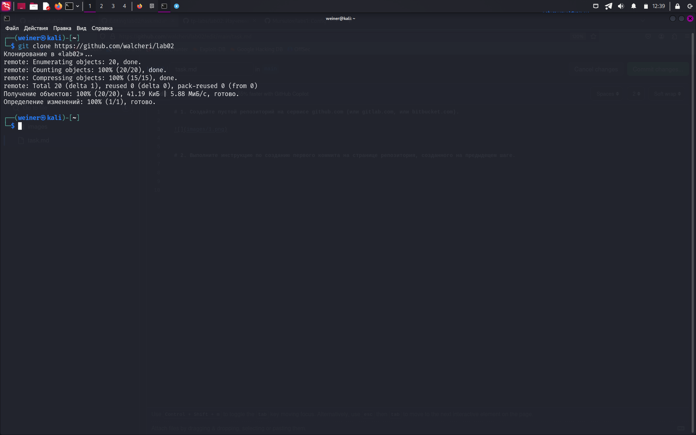
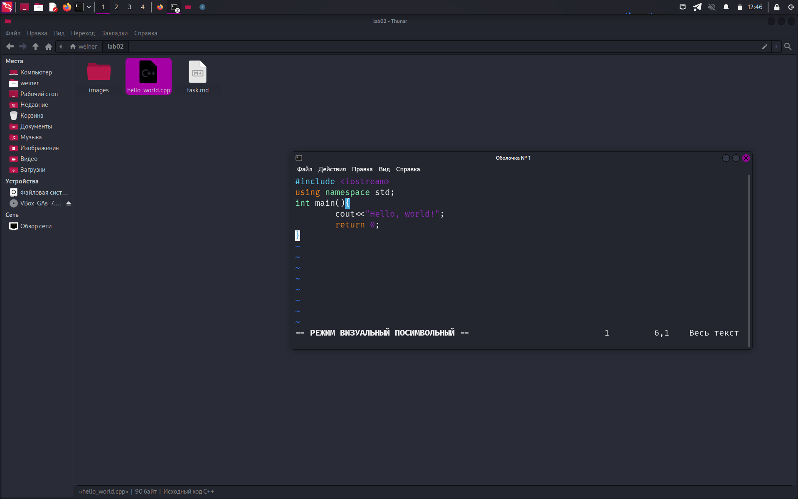

# 1. Создайте пустой репозиторий на сервисе github.com (или gitlab.com, или bitbucket.com).

# 2. Выполните инструкцию по созданию первого коммита на странице репозитория, созданного на предыдещем шаге.

# 3. Создайте файл hello_world.cpp в локальной копии репозитория (который должен был появиться на шаге 2). Реализуйте программу Hello world на языке C++ используя плохой стиль кода. Например, после заголовочных файлов вставьте строку using namespace std;.

