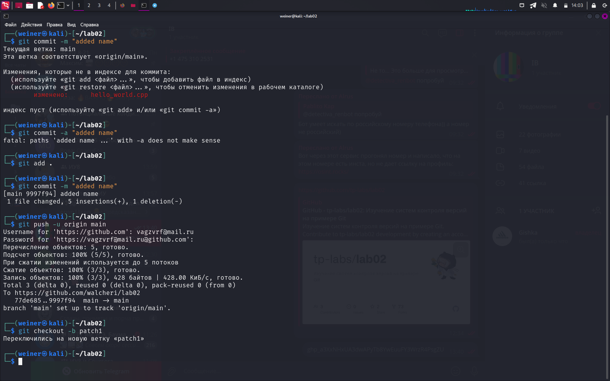

# 1. Создайте пустой репозиторий на сервисе github.com (или gitlab.com, или bitbucket.com).

# 2. Выполните инструкцию по созданию первого коммита на странице репозитория, созданного на предыдещем шаге.

# 3. Создайте файл hello_world.cpp в локальной копии репозитория (который должен был появиться на шаге 2). Реализуйте программу Hello world на языке C++ используя плохой стиль кода. Например, после заголовочных файлов вставьте строку using namespace std;.

# 4. Добавьте этот файл в локальную копию репозитория.

# 5. Закоммитьте изменения с осмысленным сообщением.

# 6. Изменитьте исходный код так, чтобы программа через стандартный поток ввода запрашивалось имя пользователя. А в стандартный поток вывода печаталось сообщение Hello world from @name, где @name имя пользователя.

# 7. Закоммитьте новую версию программы. 

# 8. Запуште изменения в удалёный репозиторий.

# 1. В локальной копии репозитория создайте локальную ветку patch1.

# 2. Внесите изменения в ветке patch1 по исправлению кода и избавления от using namespace std;.

# 3. commit, push локальную ветку в удалённый репозиторий.

# 4. Проверьте, что ветка patch1 доступна в удалёный репозитории.

# 5. Создайте pull-request patch1 -> master.

# 6. В локальной копии в ветке patch1 добавьте в исходный код комментарии.

# 7. commit, push.

# 8. Проверьте, что новые изменения есть в созданном на шаге 5 pull-request

# 9. В удалённый репозитории выполните слияние PR patch1 -> master и удалите ветку patch1 в удаленном репозитории.

# 10. Локально выполните pull.

# 11. С помощью команды git log просмотрите историю в локальной версии ветки master.

# 12. Удалите локальную ветку patch1.

# 1. Создайте новую локальную ветку patch2.

# 2. Измените code style с помощью утилиты clang-format. Например, используя опцию -style=Mozilla.

# 3. commit, push, создайте pull-request patch2 -> master.

# 4. В ветке master в удаленном репозитории измените комментарии, например, расставьте знаки препинания, переведите комментарии на другой язык.

# 5. Убедитесь, что в pull-request появились конфликтны.

# 6. Для этого локально выполните pull + rebase (точную последовательность команд, следует узнать самостоятельно). Исправьте конфликты.

# 7. Сделайте force push в ветку patch2

# 8. Убедитель, что в pull-request пропали конфликтны.

# 9. Вмержите pull-request patch2 -> master.

